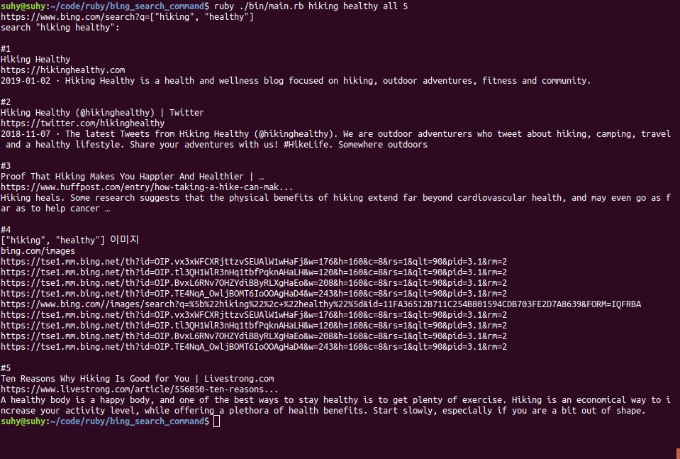
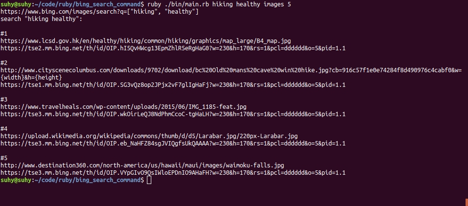
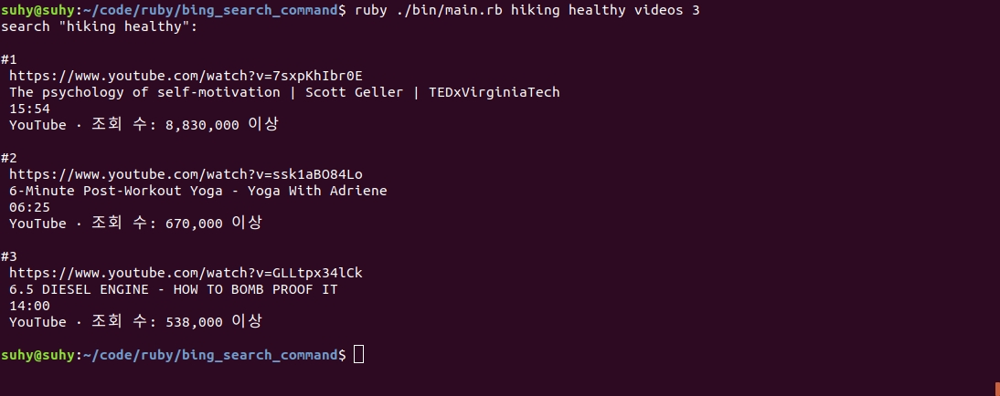

<h1 align="center">Welcome to Bing Search Command 👋</h1>

This app is using REST(Representational State Transfer).
It uses the search data from [Bing.com](https://www.bing.com/).

##### Search all


##### Search images


##### Search videos


## Built With

- Ruby 2.6
- [Nokogiri gem](https://github.com/sparklemotion/nokogiri/)

## Getting started

> Clone the repository to your local machine

```
$ git clone https://github.com/shjang7/bing_search_command.git
```

> Change directory into the directory

```
$ cd bing_search_command
```

> Test code working

```
$ rspec
```

> Run execution file

```
$ ruby ./bin/main.rb [word_1] [word_2..(optional)] [all / images / videos] [count]
```

## Author

👤 **Suhyeon Jang**

- Github: [@shjang7](https://github.com/shjang7)
- LinkedIn: [@shjang](https://www.linkedin.com/in/shjang/)
- Twitter: [@shjang12](https://twitter.com/shjang12)

## 🤝 Contributing

Contributions, issues and feature requests are welcome!<br />Feel free to check [issues page](https://github.com/shjang7/bing_search_command/issues).

1. Fork it (https://github.com/shjang7/bing_search_command/fork)
2. Create your working branch (git checkout -b [choose-a-name])
3. Commit your changes (git commit -am 'what this commit will fix/add')
4. Push to the branch (git push origin feature/[feature-name])
5. Create a new Pull Request

## Show your support

Give a ⭐️ if you like this project!

## 📝 License

This project is [MIT](https://github.com/shjang7/bing_search_command/blob/master/LICENSE) licensed.
